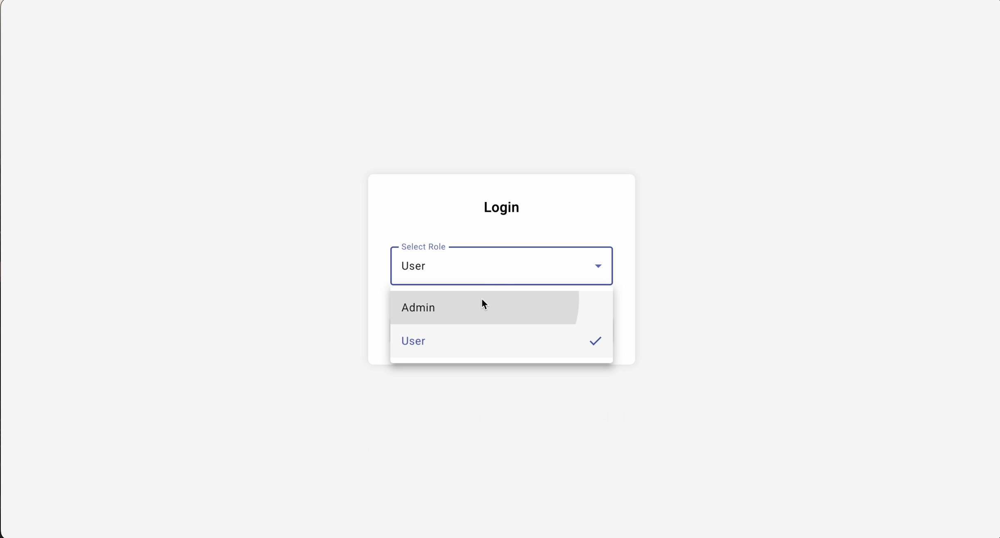

# 🧱 Angular Form Builder App

This project is a fully functional **drag-and-drop form builder** built with **Angular 14+**, **NgRx** for state management, and **localStorage** for persistence. It supports form creation, editing, submission, and role-based access (Admin/User).

---

## 🚀 Features

- 🔐 **Authentication with Role-based Access** (Admin/User)
- 🧰 **Drag-and-Drop Form Builder**
  - Text input (single-line and multi-line)
  - Select dropdown
  - Checkbox group
  - Radio buttons
  - Date picker
- ⚙️ **Configurable Field Properties**
  - Field label
  - Required/optional setting
  - Help text
  - Validation rules (min/max length, pattern, etc.)
- 💾 **Form Template Management**
  - Save, edit, Preview and delete form templates (Admin only)
- 📄 **Form Submission**
  - Validation based on field configuration
  - View-only mode for submitted forms
- 🧠 **NgRx Store** for form template state
- 🧪 **Unit Tests** for key components
- 📱 **Responsive UI** with Angular Material
- 📦 **Mock API** for form submissions

---

## State Management
NgRx Store manages all form templates. (Create/Edit/View/Delete Form Templates)

## Mock API Functions

Created Mock API Functions for Form Submission Component CRUD Operation

## 🧩 How to Use

### 1. **Login with a Role**

- Open the app at `http://localhost:4200`
- Select a role:
  - **Admin** – Can create/edit/delete/preview templates and delete/preview form submission 
  - **User** – Can only fill and submit/ view submitted forms only

---

### 2. **Admin Flow**

#### ➕ Create a New Form Template

1. Click **"New Form Template"** from the dashboard.
2. Drag and drop fields into the builder.
3. Configure field properties (label, required, validation, etc.).
4. Enter a form name.
5. Click **"Save"** to store it.

#### ✏️ Edit an Existing Template

1. In the dashboard, click the ✏️ icon next to a template.
2. Update fields or form name.
3. Save the changes.

#### 🗑️ Delete Template

- Click the 🗑️ icon next to a form to delete it.

#### 🔗 Preview Template

- Click the 1st/link icon next to a form to preview it and check the working functionality.
- Note: You cannot submit it as it is in preview mode just to check the functionality.

---

### 3. **User Flow**

#### 📋 Fill Out a Form

1. On the dashboard, click the 🔗 icon to load a form.
2. Fill in the required fields.
3. Click **"Submit"**.

> ✅ Once submitted, the form will be disabled for that user (you cannot submit it again) until Admin Deletes the Form.

---

### 4. **View Submitted Forms**

- Submitted forms appear in a separate section of the dashboard.
- Admins can view and delete submissions.

---

### 5. **Preview in View Mode**

- Click the 👁️ (or view) icon to open the form in **read-only** mode.

## DynamicFormBuilder

This project was generated with [Angular CLI](https://github.com/angular/angular-cli) version 17.3.12.

## Development server

Run `ng serve` for a dev server. Navigate to `http://localhost:4200/`. The application will automatically reload if you change any of the source files.

## Code scaffolding

Run `ng generate component component-name` to generate a new component. You can also use `ng generate directive|pipe|service|class|guard|interface|enum|module`.

## Build

Run `ng build` to build the project. The build artifacts will be stored in the `dist/` directory.

## Running unit tests

Run `ng test` to execute the unit tests via [Karma](https://karma-runner.github.io).

Test Case for 3 components Dashboard, Form-Builder and Form- Submission

- ng test --include src/app/dashboard/dashboard.component.spec.ts
- ng test --include src/app/form-builder/form-builder.component.spec.ts
- ng test --include src/app/form-submission/form-submission.component.spec.ts
